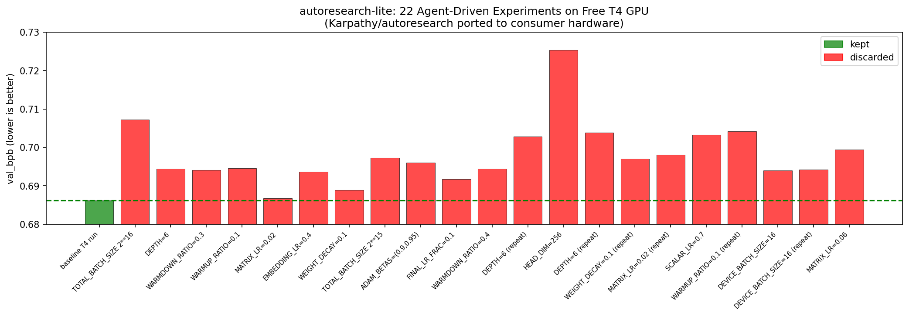

# autoresearch-lite



> *A port of [@karpathy/autoresearch](https://github.com/karpathy/autoresearch) to free consumer GPUs (Colab T4, Kaggle T4) — zero cost, zero setup, fully autonomous.*

---

## Fork scope

| | |
|---|---|
| **Upstream** | [karpathy/autoresearch](https://github.com/karpathy/autoresearch) |
| **Primary objective** | Run on free cloud GPUs (Google Colab, Kaggle T4) — zero cost, zero local setup |
| **Scope of changes** | Flash Attention 3 → PyTorch SDPA, dataset swap, scaled hyperparameters, automated agent loop notebook |
| **Non-goals** | Windows, MacOS, multi-GPU, AMD/ROCm, local setup optimization |

If you need the original H100 path, use [karpathy/autoresearch](https://github.com/karpathy/autoresearch).

---

## What this is

Karpathy's [autoresearch](https://github.com/karpathy/autoresearch) lets an AI agent run ML experiments autonomously overnight — it edits `train.py`, trains for 5 minutes, checks if `val_bpb` improved, keeps or discards, and repeats. The original requires an H100 and uses H100-only CUDA kernels.

**autoresearch-lite** ports this to hardware anyone can access for free:

- ✅ Google Colab T4 (free tier)
- ✅ Kaggle T4 (30 hrs/week free)
- ✅ Any NVIDIA GPU with CUDA compute capability ≥ 7.0

---

## What changed from the original

### 1. Flash Attention 3 → PyTorch SDPA
The original uses a Flash Attention 3 kernel (`kernels` package) that only runs on H100 (sm_90). Replaced with `torch.nn.functional.scaled_dot_product_attention` which works on any modern GPU.

```python
# Original (H100 only)
from kernels import get_kernel
attn = get_kernel("flash_attn_3")

# autoresearch-lite (any GPU)
out = F.scaled_dot_product_attention(q, k, v, is_causal=True)
```

### 2. Dataset — climbmix-400B → TinyStories
The original trains on a 400B token private dataset. This port uses [roneneldan/TinyStories](https://huggingface.co/datasets/roneneldan/TinyStories) — a public dataset of short children's stories, as recommended by Karpathy himself in the README for smaller compute setups.

### 3. Scaled-down hyperparameters for T4

| Parameter | Original (H100) | autoresearch-lite (T4) | Why |
|-----------|----------------|------------------------|-----|
| `MAX_SEQ_LEN` | 2048 | 256 | VRAM constraint |
| `VOCAB_SIZE` | 8192 | 2048 | Smaller embedding tables |
| `TOTAL_BATCH_SIZE` | 2^19 | 2^14 | Fits in 15GB VRAM |
| `DEPTH` | 8 | 4 | 5-min budget on T4 |
| `DEVICE_BATCH_SIZE` | 128 | 32 | Memory constraint |
| `WINDOW_PATTERN` | "SSSL" | "L" | Banded attention inefficient on small sequences |

### 4. bfloat16 → float16
T4 (Turing) doesn't support bfloat16 natively — that's an Ampere+ feature. All `bfloat16` casts replaced with `float16`.

### 5. Automated agent loop notebook
The original autoresearch is designed to be run with an interactive Claude/Codex session. This repo includes a self-contained Kaggle/Colab notebook (`colab_kaggle.ipynb`) with a fully automated Python agent loop:
- Calls an LLM via OpenRouter API (free tier)
- Parses responses in `DESCRIPTION / OLD / NEW` diff format (avoids truncation issues with full-file rewrites)
- Auto-commits improvements to git, reverts failures
- Resume-safe — interrupt and re-run without losing progress
- Multi-key API rotation with exponential backoff

---

## Quick start

### Option A — Kaggle (recommended, 30 hrs/week free GPU)

1. Fork this repo
2. Open [colab_kaggle.ipynb](colab_kaggle.ipynb) in Kaggle
3. Enable GPU: Settings → Accelerator → T4
4. Enable Internet: Settings → Internet → On
5. Fill in your tokens in Cell 1 and Cell 2:
   - GitHub token (for git commits): [github.com/settings/tokens](https://github.com/settings/tokens)
   - OpenRouter API key (free): [openrouter.ai](https://openrouter.ai)
6. Run Cell 1 (setup, ~3 min), Cell 2 (helpers), Cell 3 (agent loop)

### Option B — Google Colab

Same notebook works on Colab. Runtime → Change runtime type → T4 GPU.

### Option C — Local GPU (sm_70+)

```bash
git clone https://github.com/parthwhy/autoresearch-lite.git
cd autoresearch-lite
uv sync
pip install datasets
uv run prepare.py --num-shards 0   # downloads TinyStories, trains tokenizer
uv run train.py             # single baseline run
# then run the agent loop from colab_kaggle.ipynb
```

---

## Results

Baseline established on Colab T4 (free tier):

```
val_bpb:       0.686159
peak_vram:     901 MB  / 15,360 MB  (6% utilization)
num_params:    5.2M
depth:         4
total_tokens:  20.3M
training time: 5 min (fixed budget)
```

The agent ran **22 autonomous experiments** exploring learning rates, batch sizes, model depth, scheduler ratios, and optimizer parameters. All experiments are logged in [results.tsv](results.tsv).

**Key finding:** The baseline hyperparameters are already near-optimal for this model size and dataset. This is consistent with Karpathy's original results — the interesting part is the autonomous research loop itself, not any single improvement.

---

## How the agent loop works

```
┌─────────────────────────────────────────────────────┐
│                   Agent Loop                        │
│                                                     │
│  1. Read current train.py                           │
│  2. Send hyperparameters + history to LLM           │
│  3. LLM returns DESCRIPTION / OLD / NEW diff        │
│  4. Apply change via string replace                 │
│  5. Run: uv run train.py  (5 min)                   │
│  6. Parse val_bpb from stdout                       │
│  7. If improved → git commit + keep                 │
│     If worse    → git checkout (revert)             │
│  8. Log to results.tsv                              │
│  9. Repeat                                          │
└─────────────────────────────────────────────────────┘
```

---

## Project structure

```
prepare.py          — data download, tokenizer training, dataloader (modified from original)
train.py            — GPT model, Muon optimizer, training loop (modified from original)
colab_kaggle.ipynb  — automated agent loop notebook for Colab/Kaggle
results.tsv         — all experiment results
progress.png        — val_bpb over experiments
program.md          — agent instructions (from original)
```

---

## Hardware tested

| Platform | GPU | VRAM | Status |
|----------|-----|------|--------|
| Google Colab free | Tesla T4 | 15 GB | ✅ Working |
| Kaggle free | Tesla T4 | 15 GB | ✅ Working |
| Local workstation | 2× GTX 1080 Ti | 11 GB | ❌ sm_61 — PyTorch 2.9 requires sm_70+ |

---

## Credit

This is a fork of [@karpathy/autoresearch](https://github.com/karpathy/autoresearch). All core ideas, architecture, and training code are from the original. This repo only adapts it to run on free consumer hardware.

See also:
- [miolini/autoresearch-macos](https://github.com/miolini/autoresearch-macos) — MacOS port
- [trevin-creator/autoresearch-mlx](https://github.com/trevin-creator/autoresearch-mlx) — MLX port
- [jsegov/autoresearch-win-rtx](https://github.com/jsegov/autoresearch-win-rtx) — Windows RTX port

---
* Submitted for listing in [karpathy/autoresearch notable forks](https://github.com/karpathy/autoresearch)

## About the author

Built by [Parth Patel](https://github.com/parthwhy) as a learning project while exploring AI engineering. Open to feedback, PRs, and internship opportunities.

---

*MIT License*
